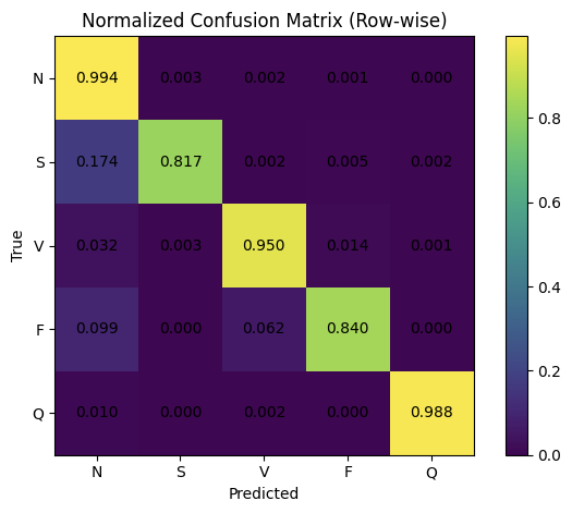
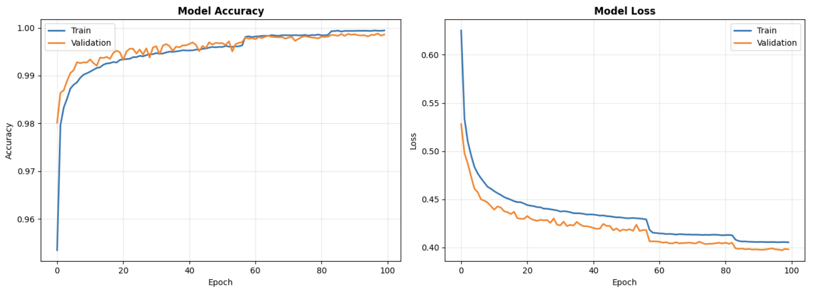
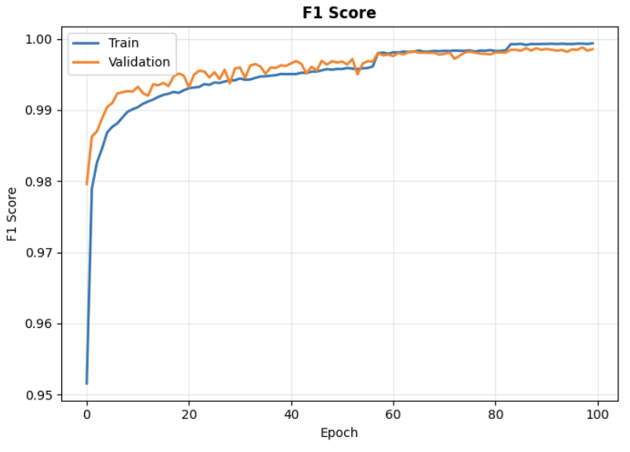
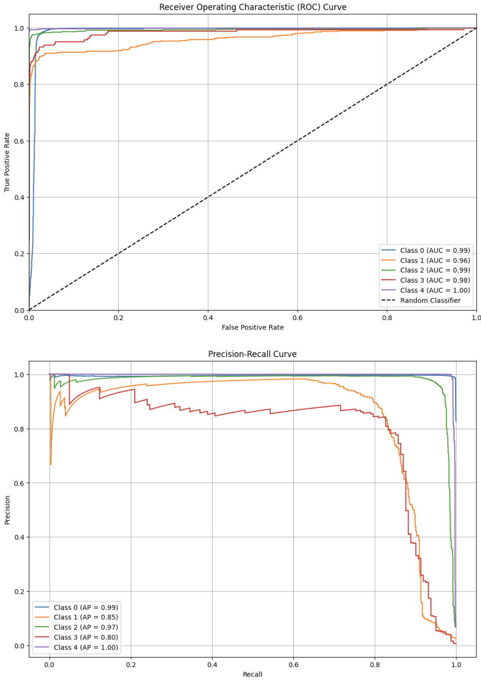

# ECG Arrhythmia Classification using 1D CNN on MIT-BIH Dataset

End-to-end deep learning pipeline for classifying cardiac arrhythmias from ECG signals.

## Goal
Classify heartbeats into 5 classes (N, S, V, F, Q) following AAMI standards using 1D Convolutional Neural Network with Residual Connections.

## Dataset Download
- MIT-BIH Arrhythmia Database (PhysioNet)
- Preprocessed version often used: https://www.kaggle.com/shayanfazeli/heartbeat (MITBIH_train.csv, MITBIH_test.csv)
- Or download raw from: https://physionet.org/content/mitdb/1.0.0/

# Dataset Details
- Number of Samples: 109446
- Number of Categories: 5
- Sampling Frequency: 125Hz
- Data Source: Physionet's MIT-BIH Arrhythmia Dataset
- Classes: ['N': 0, 'S': 1, 'V': 2, 'F': 3, 'Q': 4]
Remark: All the samples are cropped, downsampled and padded with zeroes if necessary to the fixed dimension of 188.

## Features
- Signal preprocessing (normalization, segmentation, bandpass filtering)
- 1D ResNet-type CNN model (inspired by popular architectures)
- Evaluation: accuracy, F1-score, confusion matrix, ROC
- Noise robustness notes in future work

## Motivation
Cardiac arrhythmias are abnormalities in the heart's electrical activity, leading to an irregular, too fast, or too slow heartbeat. They can range from benign to life-threatening.

### Different Types of Cardiac Arrhythmias

Arrhythmias can be classified in various ways, often based on their origin within the heart (atria or ventricles), their rate (tachycardia or bradycardia), and their regularity.

Here are some common types:

#### 1. By Heart Rate:

*   **Tachycardia:** A heart rate that is too fast (typically over 100 beats per minute at rest).
*   **Bradycardia:** A heart rate that is too slow (typically under 60 beats per minute at rest).

#### 2. By Origin in the Heart:

##### A. Supraventricular Arrhythmias (Originating above the ventricles, in the atria or AV node):

*   **Sinus Tachycardia:** A faster-than-normal heart rate originating from the sinus node. Often a normal response to exercise, stress, fever, etc., but can be inappropriate.
*   **Sinus Bradycardia:** A slower-than-normal heart rate originating from the sinus node. Can be normal in athletes but also indicate heart disease.
*   **Premature Atrial Contractions (PACs) / Atrial Premature Beats (APBs):** Early beats originating in the atria outside the sinus node. Often harmless and common.
*   **Atrial Fibrillation (AFib):** The most common serious arrhythmia. The atria beat chaotically and irregularly, leading to an irregularly irregular ventricular response. Can cause blood clots, stroke, and heart failure.
*   **Atrial Flutter:** The atria beat regularly but very rapidly (e.g., 250-350 bpm), often in a "sawtooth" pattern on an ECG, typically with a regular conduction ratio to the ventricles (e.g., 2:1 or 3:1 block).
*   **Supraventricular Tachycardia (SVT):** A broad term for fast heart rhythms originating above the ventricles, often caused by re-entrant circuits. Includes:
    *   **AV Nodal Reentrant Tachycardia (AVNRT):** Most common type of SVT, involving a re-entry circuit within the AV node.
    *   **AV Reentrant Tachycardia (AVRT) / Wolff-Parkinson-White (WPW) Syndrome:** Involves an accessory pathway between atria and ventricles.
    *   **Ectopic Atrial Tachycardia:** Fast rhythm from a single abnormal focus in the atria.
*   **Junctional Rhythm (or Nodal Rhythm):** The heart's pacemaker shifts to the AV node when the sinus node fails or is too slow.

##### B. Ventricular Arrhythmias (Originating in the ventricles):

*   **Premature Ventricular Contractions (PVCs) / Ventricular Premature Beats (VPBs):** Early beats originating in the ventricles. Common, often harmless, but frequent or complex PVCs can indicate underlying heart disease or risk for more serious arrhythmias.
*   **Ventricular Tachycardia (VT):** A rapid heart rhythm originating from the ventricles. Can be sustained or non-sustained. Sustained VT is a life-threatening emergency, as it can lead to hemodynamic instability or progress to Vfib.
*   **Ventricular Fibrillation (VFib):** A chaotic, unsynchronized electrical activity in the ventricles, causing them to quiver uselessly instead of pumping blood. This is a medical emergency that leads to sudden cardiac arrest and requires immediate defibrillation.
*   **Torsades de Pointes:** A specific type of polymorphic VT characterized by a twisting appearance of the QRS complexes on an ECG, often associated with prolonged QT interval. It can degenerate into VFib.

##### C. Bradyarrhythmias / Conduction Blocks:

*   **Heart Blocks (AV Blocks):** Problems with the electrical signal conduction from the atria to the ventricles.
    *   **First-Degree AV Block:** Delayed conduction; all atrial impulses reach the ventricles, but the PR interval is prolonged. Usually benign.
    *   **Second-Degree AV Block (Mobitz Type I / Wenckebach):** Progressively prolonged PR interval until a beat is dropped.
    *   **Second-Degree AV Block (Mobitz Type II):** Intermittent dropped beats without progressive PR prolongation. More serious, can progress to complete heart block.
    *   **Third-Degree (Complete) AV Block:** No atrial impulses reach the ventricles; atria and ventricles beat independently (AV dissociation). Requires a pacemaker.
*   **Sick Sinus Syndrome:** A group of conditions where the heart's natural pacemaker (sinus node) doesn't function properly, leading to slow heart rates, pauses, or alternating fast and slow rhythms (tachy-brady syndrome).

### Why Automatic Prediction is Important

Automatic prediction of cardiac arrhythmias is critically important for several reasons:

1.  **Early Detection and Prevention of Adverse Events:**
    *   **Stroke Prevention:** Arrhythmias like Atrial Fibrillation significantly increase the risk of stroke due to blood clot formation. Early detection allows for timely initiation of anticoagulation therapy.
    *   **Sudden Cardiac Death (SCD) Prevention:** Life-threatening arrhythmias like Ventricular Tachycardia and Ventricular Fibrillation can lead to SCD. Predicting their onset or identifying patients at high risk can enable proactive interventions (e.g., implantable cardioverter-defibrillators - ICDs, ablation).
    *   **Heart Failure Management:** Persistent arrhythmias can worsen heart failure. Early detection and management can prevent disease progression.

2.  **Timely Intervention and Treatment:**
    *   **Acute Management:** In emergency settings, automatic detection can quickly identify critical arrhythmias (e.g., VFib, sustained VT) that require immediate defibrillation, cardioversion, or medication.
    *   **Guidance for Therapies:** Prediction can help guide treatment strategies, such as antiarrhythmic medications, cardiac ablation, or pacemaker/ICD implantation.

3.  **Improved Diagnosis and Monitoring:**
    *   **Paroxysmal Arrhythmias:** Many arrhythmias are paroxysmal (occur sporadically) and may be missed during a short clinical ECG. Automatic analysis of long-term ECG recordings (Holter monitors, wearable devices) can detect these elusive events.
    *   **Reduced Clinician Workload:** Manually reviewing hours or days of ECG data is time-consuming and prone to human error. Automated systems can sift through vast amounts of data, highlighting significant events for review by clinicians.
    *   **Continuous Monitoring:** For high-risk patients (e.g., post-myocardial infarction, post-surgery), continuous automated monitoring can provide alerts for dangerous arrhythmias as they arise.

4.  **Personalized Medicine:**
    *   **Risk Stratification:** AI models can identify subtle patterns in ECGs that may indicate a higher risk for future arrhythmias, allowing for personalized risk assessment and preventive strategies.
    *   **Treatment Efficacy:** Monitoring systems can automatically track the frequency and type of arrhythmias before and after treatment, helping assess the effectiveness of interventions.

5.  **Accessibility and Remote Healthcare:**
    *   **Telemedicine:** Automatic prediction tools integrated into wearable devices can enable remote monitoring, extending cardiac care to patients in rural areas or those with limited access to specialists.
    *   **Point-of-Care Diagnostics:** Simplified, automated tools could facilitate rapid arrhythmia detection in non-specialized settings.

### Specific Types of Arrhythmias Present in Physionet's MIT-BIH Arrhythmia Dataset

The MIT-BIH Arrhythmia Database is a widely used benchmark for evaluating arrhythmia detection algorithms. It contains 48 half-hour two-channel ambulatory ECG recordings, manually annotated by expert cardiologists.

The annotations in the MIT-BIH database classify individual heartbeats. While it has detailed annotations for various specific beat types, for algorithm evaluation, beats are often grouped into **AAMI (Association for the Advancement of Medical Instrumentation) recommended classes**:

1.  **N (Normal Beat):**
    *   Normal beat (N)
    *   Left bundle branch block beat (L)
    *   Right bundle branch block beat (R)
    *   Aberrated atrial premature beat (A)
    *   Nodal (junctional) beat (j)

2.  **S (Supraventricular Ectopic Beat):**
    *   Atrial premature beat (a)
    *   Supraventricular premature beat (S)
    *   Nodal (junctional) premature beat (J)
    *   (Also 'A' from the N group if not aberrated, but typically moved to S for general SVT detection)

3.  **V (Ventricular Ectopic Beat):**
    *   Premature ventricular contraction (PVC) (V)
    *   Ventricular escape beat (E)

4.  **F (Fusion Beat):**
    *   Fusion of ventricular and normal beat (F)

5.  **Q (Unknown Beat):**
    *   Paced beat (/) (often excluded or treated as normal depending on context)
    *   Fusion of paced and normal beat (f)
    *   Unclassifiable beat (Q)

Beyond individual beat classifications, the dataset also contains annotations for **rhythm types or events** occurring during the recording, such as:

*   **AFIB (Atrial Fibrillation)**
*   **VT (Ventricular Tachycardia)**
*   **VFL (Ventricular Flutter / Fibrillation)**
*   **ASYS (Asystole)**
*   **BRADY (Bradycardia)**
*   **TACHY (Tachycardia)**
*   **AVB (AV Block)**
*   **SVTA (Supraventricular Tachyarrhythmia)**
*   **BIGEMINY, TRIGEMINY** (patterns of PVCs)
*   **PACE (Paced rhythm)**

Therefore, while algorithms often focus on classifying individual beats into the AAMI groups, the raw annotations in the MIT-BIH dataset provide rich information about a wide range of specific arrhythmias and their patterns.

## Results
Test Results:
- Loss: 0.4348
- Accuracy: 0.9851
- Sensitivity: 0.9839
- Specificity: 0.9966
- F1-Score: 0.9850
- Expected Calibration Error (ECE): 0.024786

## Installation
pip install -r requirements.txt

## Author
Tilendra Choudhary – Biomedical Informatics & ML

## License
MIT